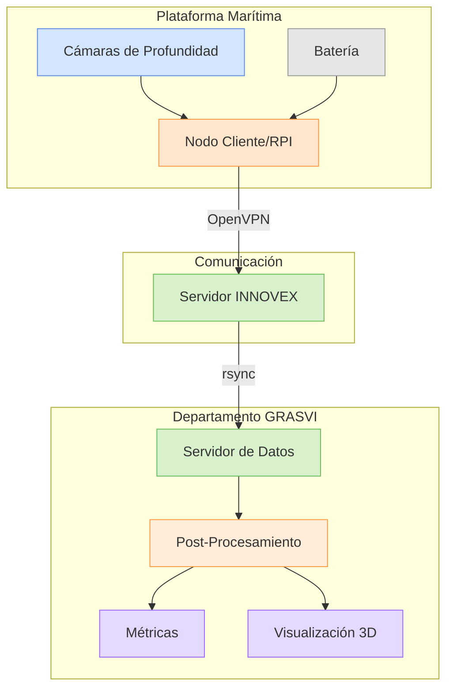
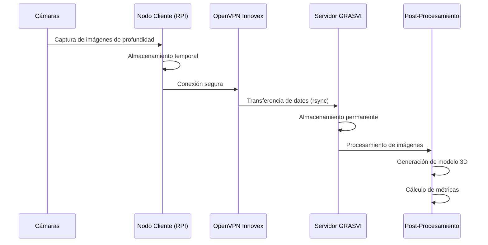

# SILO CAM

## Sistema de Monitoreo de Silos para Estimación de Alimentos para Peces

## Descripción

SILO CAM es un sistema de monitoreo automatizado para silos de alimentación de peces en instalaciones acuícolas. El proyecto utiliza cámaras de profundidad para capturar imágenes de los silos, generando modelos 3D que permiten estimar con precisión la cantidad de alimento disponible para los peces.

## Arquitectura del Sistema

El sistema está compuesto por dos componentes principales distribuidos en diferentes ubicaciones:

1. **Plataforma Marítima**: 
   - Cámaras de profundidad
   - Nodo cliente (Raspberry Pi)
   - Sistema de alimentación (batería)

2. **Departamento GRASVI**:
   - Servidor de datos
   - Sistema de post-procesamiento
   - Generación de métricas y visualizaciones

La comunicación entre estos componentes se realiza a través de la VPN de OpenVPN de Innovex, garantizando una conexión segura y privada.


## Estructura del Proyecto

```
silo_cam/
├── src/
│   ├── client/    # Código para el nodo cliente (RPI)
│   └── server/    # Código del servidor y procesamiento
```

- **client**: Contiene el código que se ejecuta en el nodo cliente (Raspberry Pi) ubicado en la plataforma marítima.
- **server**: Abarca el código del servidor que procesa los datos y genera los modelos 3D y métricas.

## Flujo de Trabajo

1. Las cámaras capturan imágenes de profundidad del silo
2. El nodo cliente (RPI) almacena temporalmente estas imágenes
3. Los datos se transfieren al servidor GRASVI mediante rsync a través de OpenVPN
4. El servidor procesa las imágenes para generar un modelo 3D
5. Se calculan métricas para estimar la cantidad de alimento disponible



## Wiki del Proyecto

| Sección | Enlace |
|---------|--------|
| Página Principal | [Home](https://forge.innovex.cl/nicolas.donoso/silo_cam/wiki/Home) |
| Instalación de VPN | [Instalación de VPN](https://forge.innovex.cl/nicolas.donoso/silo_cam/wiki/Instalaci%C3%B3n-de-VPN) |
| Sistema con Contenedores | [Sistema con Contenedores](https://forge.innovex.cl/nicolas.donoso/silo_cam/wiki/sistema-con-contenedores) |
| Diseño, Fabricación y Ensamblaje | [Diseño, Fabricación y Ensamblaje](https://forge.innovex.cl/nicolas.donoso/silo_cam/wiki/DIse%C3%B1o%2C-Fabricacion-y-Ensamblaje) |
| Configuración de Crontab | [Configuración de Crontab](https://forge.innovex.cl/nicolas.donoso/silo_cam/wiki/Configuraci%C3%B3n-de-crontab) |
| Ambientación de Cliente | [Ambientación de Cliente (RPI3b+, RPI4, RPI5)](https://forge.innovex.cl/nicolas.donoso/silo_cam/wiki/Ambientacion-de-Cliente-sistemas-arm-%2528RPI3b%252B%252C-rpi4%252C-rpi5%2529.md) |

## Requisitos

- Raspberry Pi (3b+, 4 o 5) como nodo cliente
- Cámaras de profundidad compatibles
- Conexión a VPN Innovex
- Configuración de rsync para transferencia de datos

## Contribuir

Para contribuir al proyecto, consulta la documentación en la wiki y comunícate con el equipo de desarrollo.

## Licencia

Este proyecto es propiedad de Innovex.